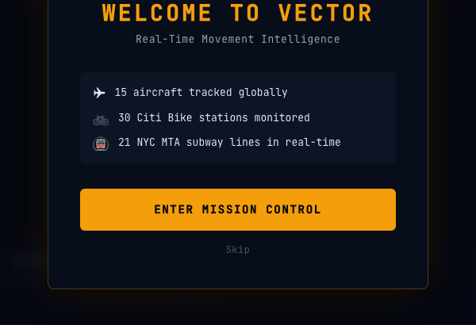
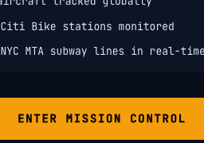
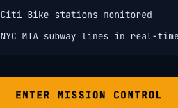
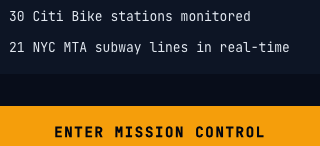
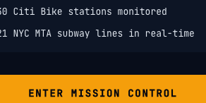

# Development Journal — 2026-04-07

---

### Map Overhaul + Live APIs
**Time:** 2026-04-07T01:47:33.146Z
**Type:** feature
**Feature:** Map Overhaul + Live APIs
**Prompt:** improve the map views which are currently rough, and integrate with free APIs to enhance the map data
**Scenarios:** DarkTileLayer - WorldView, DarkTileLayer - NYC, DarkTileLayer - Atlantic, FlightMarker - Transatlantic, FlightMarker - Pacific, FlightMarker - NoRoute, BikeStationMarker - Available, BikeStationMarker - Low, BikeStationMarker - Empty, BikeStationMarker - Offline

Added Carto Dark Matter tile layer to FlightMap and BikeMap (both previously had no basemap). Integrated Citi Bike GBFS for live NYC station availability and OpenSky Network for real aircraft positions. Extracted DarkTileLayer, FlightMarker, BikeStationMarker components and gbfs.ts/opensky.ts lib functions with 41 tests.

**Scenario Screenshots:**

**Commit:** `25d0432` — feat: Map Overhaul + Live APIs
