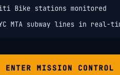

# Development Journal — 2026-04-07

---

### Map Overhaul + Live APIs
**Time:** 2026-04-07T01:47:33.146Z
**Type:** feature
**Feature:** Map Overhaul + Live APIs
**Prompt:** improve the map views which are currently rough, and integrate with free APIs to enhance the map data
**Scenarios:** DarkTileLayer - WorldView, DarkTileLayer - NYC, DarkTileLayer - Atlantic, FlightMarker - Transatlantic, FlightMarker - Pacific, FlightMarker - NoRoute, BikeStationMarker - Available, BikeStationMarker - Low, BikeStationMarker - Empty, BikeStationMarker - Offline

Added Carto Dark Matter tile layer to FlightMap and BikeMap (both previously had no basemap). Integrated Citi Bike GBFS for live NYC station availability and OpenSky Network for real aircraft positions. Extracted DarkTileLayer, FlightMarker, BikeStationMarker components and gbfs.ts/opensky.ts lib functions with 41 tests.

**Scenario Screenshots:**

**Commit:** `25d0432` — feat: Map Overhaul + Live APIs

---

### Bike Icon Markers
**Time:** 2026-04-07T17:44:12.740Z
**Type:** feature
**Feature:** Bike Icon Markers
**Prompt:** For the City Bikes tab, make the dots more clearly look like bikes (bike icon markers instead of plain dots), and clean up the UI at different zoom levels
**Scenarios:** BikeStationPopup - Available, BikeStationPopup - Low, BikeStationPopup - Empty, BikeStationPopup - Offline

Replaced plain circle markers on the City Bikes map with custom SVG bicycle icons rendered as Leaflet DivIcons. Each icon is color-coded by station availability (green/amber/red/gray) with a matching glow effect. Markers scale responsively with zoom: 14px at city level (z≤13), 20px at neighborhood level (z14-15), and 26px with a station name label at street level (z≥16). Extracted getMarkerColor, getMarkerGlowColor, and getMarkerSize as tested pure functions in gbfs.ts, and split the popup content into a standalone BikeStationPopup component.

**Scenario Screenshots:**

**Commit:** `923e58b` — feat: Bike Icon Markers
