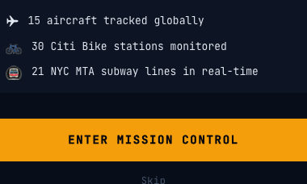
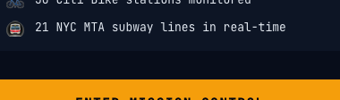

# Development Journal — 2026-04-08

---

### Flight Track Panel
**Time:** 2026-04-08T01:11:18.528Z
**Type:** feature
**Feature:** Flight Track Panel
**Prompt:** Click-to-track a flight: select any aircraft on the flight map and get a detail panel showing route arc, altitude/speed data, live status, airline info, and origin/destination. Creates an interactive moment for demos.
**Scenarios:** FlightPanelHeader - EnRoute, FlightPanelHeader - Delayed, FlightPanelHeader - LongCallsign, FlightRouteSection - EarlyFlight, FlightRouteSection - MidFlight, FlightRouteSection - NearLanding, FlightKpiGrid - Cruising, FlightKpiGrid - Descending, FlightKpiGrid - TakingOff, FlightKpiGrid - Zeroes, FlightPositionRow - NorthAtlantic, FlightPositionRow - NearJFK, FlightPositionRow - SouthernHemisphere, FlightDetailPanel - TransatlanticEnRoute, FlightDetailPanel - DomesticDelayed, FlightDetailPanel - NoRouteData, FlightDetailPanel - NearLanding

Added a cinematic click-to-track flight panel to the Air Traffic map. Clicking any flight marker triggers a slide-in detail panel showing the callsign with amber glow, animated live status badge, route arc with progress indicator, KPI grid (altitude/speed/heading), and DMS coordinates. Selected markers display a tactical reticle crosshair; all other markers dim to 10% opacity. Extracted 5 sub-components (FlightPanelHeader, FlightRouteSection, FlightKpiGrid, FlightPositionRow, FlightDetailPanel) and 2 pure functions (hasRouteData, getFlightKpis) with 10 new tests.

**Scenario Screenshots:**

**Commit:** `04eb117` — feat: Flight Track Panel
